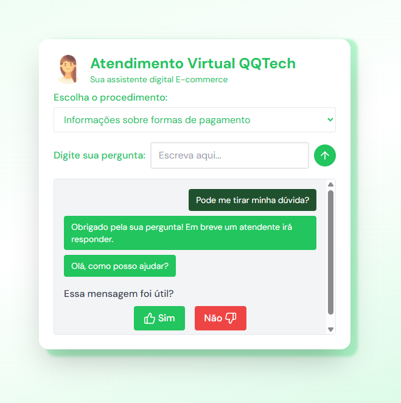

# 🤖 novo-frontChatbot

Bem-vindo ao **novo-frontChatbot**!  
Este projeto é uma aplicação web desenvolvida em Vue 3 + Vite, com um dashboard administrativo e um chatbot virtual para atendimento ao cliente.



---

## 🚀 Funcionalidades

- **Chatbot Virtual**: Chatbot da QQ Tech, com opções de perguntas frequentes e respostas automáticas.
- **Dashboard Administrativo**: Visualização de tabelas (clientes, soluções, interações, chamados, funcionários) com filtros e gráficos interativos.
- **Gráficos Dinâmicos**: Visualização de dados com Chart.js (vue-chartjs), incluindo gráficos de pizza, barras e tempo médio de atendimento.
- **Login Simples**: Alternância entre tela do chatbot e dashboard via autenticação simulada.
- **Menu Responsivo**: Menu hamburguer adaptado para desktop e mobile.

---

## 🛠️ Tecnologias Utilizadas

- [Vue 3](https://vuejs.org/)
- [Vite](https://vitejs.dev/)
- [Pinia](https://pinia.vuejs.org/) (gerenciamento de estado)
- [Vue Router](https://router.vuejs.org/)
- [Chart.js + vue-chartjs](https://vue-chartjs.org/)
- [Tailwind CSS](https://tailwindcss.com/)
- [TypeScript](https://www.typescriptlang.org/)

---

## 📦 Instalação

Clone o repositório e instale as dependências:

```sh
# git clone https://github.com/seu-usuario/novo-frontChatbot.git
cd novo-frontChatbot
npm install
```
